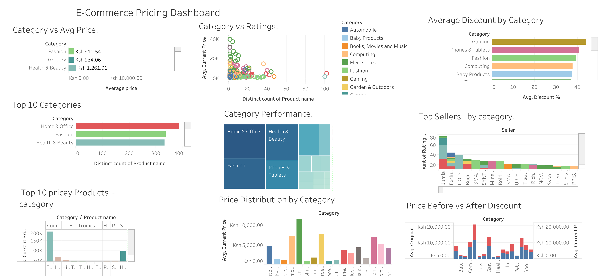

# Price Optimization Tool

### Project Collaboration

- [Notion](https://www.notion.so/270e26877fdd815a9017da739a7c8dd7?v=270e26877fdd81c7a17a000c18496f82&source=copy_link) served as our central hub for organizing tasks and resources. We used it to:  
      - Share notes and useful links in one accessible space.  
      - Document meeting notes and decisions for easy reference. 
      - Track deadlines and assigned responsibilities through task boards.  
      - Enable real-time collaboration, reducing miscommunication and delays.

### Project Authors
1. [Lewis Mbugua]
2. [Elizabeth Ogutu](https://www.linkedin.com/in/elizabeth-ogutu-36222b1a6/)
3. [Hafsa M. Aden](https://www.linkedin.com/in/hafsa-m-aden-330451223/)
4. [Ryan Karimi](https://www.linkedin.com/in/ryan-karimi-39a701326/)
5. [Harrison Kuria](https://www.linkedin.com/in/harrison-kuria-md-a35487a4/?utm_source=share&utm_campaign=share_via&utm_content=profile&utm_medium=android_app)
6. [Rose Muthini](https://www.linkedin.com/in/syomiti-muthini-03849a153/)

## Business Understanding
*At what price should one sell a product to remain competitive while still making a profit?*

### Problem Statement:
- Pricing is one of the most critical decisions for any seller. While costs, margins, and supplier agreements guide internal pricing, what’s often missing is visibility into how competitors price similar products. Without this context, sellers face two key risks:
    - Overpricing → losing customers to cheaper alternatives.
    - Underpricing → cutting into profits unnecessarily.

- New sellers entering marketplaces often struggle with:
    - Price variability – Similar products can vary widely in price (e.g., KSh 499 vs KSh 8,900).
    - Discount strategy – Discounts strongly influence buyers, but the "sweet spot" is unclear.

### Objectives: 
- This project aims to bridge that gap by providing data-driven insights from marketplace listings (e.g., product categories, ratings, reviews, discounts). By benchmarking against competitors, sellers gain real-time market information that complements their cost-based pricing strategies, enabling them to set prices that are both competitive and profitable.    

### Stakeholders
- New Sellers : Data-backed guidance on product selection & pricing.
- Marketplace (Jumia): Gains from onboarding more sellers and improving customer experience.
- Business Development Teams: Use insights to attract and support vendors.

### Potential Impact: 
- This tool can 
    - Help sellers price new products competitively from day one
    - Reduce the time sellers spend on manual competitor research
    - Increase sales conversions by ensuring listings are within market-accepted ranges

## Data Understanding

### Data Source
- The dataset we worked with was scraped from [Jumia](https://www.jumia.co.ke/). 
- It consist of 1,999 product listings with 13 features (columns) including: 
     - current_price → Current product price.
     - original_price → Price before discount
     - discount → Discount percentage
     - main_category → Product category (electronics, fashion, etc.)
     - rating_number & verified_ratings → Customer satisfaction.
     - seller → Who is selling the item.
     - title → Product description.

### Data Preparation
- To prepare the dataset for analysis, we applied the following steps:  
   - Removed duplicates: Many sellers list the same product multiple times.
   - Handled missing values: Some products lacked ratings or discounts. Strategies included:
       - Filling missing numeric values with averages.
       - Dropping irrelevant text-only columns when not useful for modeling.
   - Converted datatypes: Prices were stored as strings (KSh 499 → 499). Converted to integers.
   - Created new features:
       - discount_amount = original_price - current_price
       - discount_ratio = % discount offered

## Analysis Overview

- We explored the dataset to understand patterns and relationships among products listed on Jumia Kenya, focusing on:
     - pricing behavior
     - discount strategies
     - customer ratings, and category-level 
     - competitiveness among products listed on Jumia Kenya.

- The process involved four main steps: 
     - data preparation
     - visual exploration
     - category-level analysis
     - feature engineering.

### Price distribution:
- To explore the relationship between original prices and discounts, a correlation analysis was conducted. The resulting correlation coefficient (0.08) indicates a very weak relationship between the two variables. 
- This suggests that both low-priced and high-priced products are equally likely to receive discounts, meaning discount rates are not strongly influenced by a product’s original price.

### Impact of discounts on product visibility.

- To understand how discounts differ across product price tiers, products were grouped into four ranges:
     - Low (<1,000 KSh)
     - Mid (1,000–5,000 KSh)
     - High (5,000–10,000 KSh)
     - Very High (>10,000 KSh)

- Discount by Price Range
     - Discounts remain fairly consistent across all price ranges.
     - Whether products are low, mid, or high priced, they receive similar discount percentages, which is unexpected, as higher-priced items are often assumed to have larger discounts.

- Discount by Product Category: 
     - *Gaming* and *Phones & Tablets* show the highest average discounts (40%+) likely due to strong competition and frequent model updates.
     - *Groceries* have the lowest discounts, reflecting their smaller profit margins.
     - *Fashion*, *Computing*, and *Health & Beauty* maintain moderate discounts (20–40%), suggesting similar pricing strategies across these segments.

- Summary:
     - Discount strategies are largely independent of product price, with consistent discount patterns across most price ranges and categories. 
     - *Gaming* and *Phones & Tablets* receive the highest discounts likely due to competition and frequent model updates, while *Groceries* show the lowest. 
     - Overall discounts do not appear strongly influenced by either product price or customer ratings.

### Product Competitiveness.

- To identify the best-value or “deal” products, we assessed competitiveness within each category. A product was considered competitive if:
     - Its price was at or below the category’s median price, and
     - It had a rating of 4.0 or higher.

- This method highlights products that are both affordable and well-rated, revealing which categories offer the best balance between price and customer satisfaction.

| Main Category             | Competitive (%) |
|----------------------------|-----------------|
| Grocery                    | 47.06 |
| Computing                  | 32.67 |
| Sporting Goods             | 31.25 |
| Automobile                 | 29.73 |
| Gaming                     | 28.57 |
| Home & Office              | 28.17 |
| Health & Beauty            | 26.51 |
| Industrial & Scientific    | 26.09 |
| Baby Products              | 23.08 |
| Toys & Games               | 19.51 |
| Electronics                | 18.54 |
| Pet Supplies               | 18.18 |
| Garden & Outdoors          | 16.28 |
| Fashion                    | 14.25 |
| Phones & Tablets           | 13.64 |
| Books, Movies and Music    | 12.28 |
| Musical Instruments        | 0.00 |

- key Insights: 
     - *Grocery* items are the most competitive (47%), showing strong affordability and consistent ratings.
     - *Computing*, *Sporting Goods*, and *Automobile* categories follow closely (~30%).
     - *Fashion*, *Phones & Tablets*, and *Books* & *Music* have the lowest competitiveness, likely due to higher prices or lower ratings.

- Overall, competitiveness varies widely across categories, showing that strong performance (good price + good ratings) is not uniform across product types.

### Correlation Matrix
- There is a strong positive correlation between current and original prices as current prices are derived from discounts.
- Discounts shows weak influence on price, suggesting they serve more as marketing tools than true price drivers. 
- There’s no clear link between price and ratings, indicating that expensive products don’t necessarily receive better reviews. 
- While discounted products may attract slightly more ratings, the effect is minimal. As expected, products with more reviews tend to have slightly higher average ratings.

- For more detailed breakdown of the analysis, see the full notebook: [Price_Optimization.ipynb]()

### Visual Exploration

- We created various charts to observe how price interacts with discounts, ratings, and the number of verified reviews:
     - Relationship Between Original Price & Discount Percentage
  

     - Discount by Price Range
  

     - Discount by Ratings 
     - Correlation between Numeric Variables 

### Dashboard Summary

- All findings were consolidated into an interactive [Tableau Dashboard](https://public.tableau.com/app/profile/elizabeth.ogutu/viz/Booktwo_17595891616540/Dashboard1?publish=yes) for quick exploration.

- Below are some of the findings:
     - Discounts are common but not price-dependent. Sellers may use them for visibility rather than clearing expensive stock.
     - Ratings remain consistent across price ranges; quality perception doesn’t rise with price
     - Electronics and Computing have the highest median prices; Grocery and Fashion are the most competitive.
     - The generated watchlists help identify undervalued products suitable for promotion or bulk purchase

## Modeling Overview

- Before building predictive models, the data was cleaned and preprocessed. Missing values were imputed, categorical variables were encoded, and numerical features were scaled to ensure consistency and improve model performance. The dataset was then split into training (80%) and testing (20%) subsets to evaluate how well each model generalizes to unseen data.

### Models Developed

- Several regression models were developed to predict the target variable based on product and pricing features:
     - Linear Regression served as a baseline for performance comparison.
     - K-Nearest Neighbors (KNN) Regressor captured local relationships in the data.
     - Decision Tree Regressor modeled non-linear patterns and feature interactions.
     - Random Forest Regressor leveraged multiple decision trees for better generalization.
     - Neural Network (MLP Regressor) tested for its ability to model complex, non-linear relationships.

- All models were trained using a consistent preprocessing pipeline built with ColumnTransformer and Pipeline, ensuring reproducibility and effecient feature handling.

### Model Performance

 - Initial model results showed the following trends:
     - Linear Regression performed strongly, achieving an R² of 0.96, indicating a solid linear fit.
     - KNN and Decision Tree achieved R² scores of 0.91 and 0.88 respectively, suggesting some overfitting or sensitivity to data structure.
     - Neural Network showed moderate performance (R² of 0.87) but required longer training and did not converge fully.
     - Random Forest delivered a high R² of 0.94, significantly reducing error and improving predictive stability.
     
### Model Optimization

- To further improve accuracy, GridSearchCV was applied for hyperparameter tuning across three advanced models:
     - Ridge Regression
     - Lasso Regression
     - Random Forest Regressor

- Each model was fine-tuned using 3-fold cross-validation to identify best performing parameters.

### Model Selection

- Model performance was compared using the following metrics: 
     - Mean Absolute Error (MAE)
     - Mean Squared Error (MSE)
     - Root Mean Squared Error (RMSE)
     - R-squared (R²).

| Model           | Mean Absolute Error (MAE) | Mean Squared Error (MSE) | Root Mean Squared Error (RMSE) | R-squared (R²) |
| ----------------| ------------------------- | ------------------------ | ------------------------------ | -------------- |
| Random Forest   | 285.90                    | 721,254                  | 849.27                         | 0.9923         |
| Ridge Regression| 1001.57                   | 3,691,000                | 1921.20                        | 0.9606         |
| Lasso Regression| 815.11                    | 3,692,944                | 1921.70                        | 0.9606         |

- Interpretation: 
     - The Random Forest Regressor emerged as the best-performing model achieving:
         - MAE: 285.90
         - MSE: 721,254
         - R²: 0.99

    - MAE measures the average difference between predicted and actual values (model’s predictions deviate by about 286 units on average).
    - The Mean Squared Error (MSE) penalizes larger errors more heavily, indicating overall low prediction errors.
    - R² = 0.99 means the model explains 99% of the variance in the target variable, making it the most accurate and robust choice for deployment.

- Conclusion:
     - Random Forest was selected as the final model and deployed due to its accuracy, reliability and performance.     

## Deployment

- The project was deployed as a Flask web app and hosted on Render.
- For the Frontend, we created a simple site where people can explore the project. The site has diffrent pages:
    - Home → welcoming page with project overview.
    - Data → a page describing the dataset used.
    - Research → key findings and insights.
    - Team → information about the contributors.
- There’s also a prediction form where a user can enter product details and instantly see the predicted price.

- The backend uses a Random Forest model trained on our dataset. The outcome is a live, user-friendly web app that makes predictions in real time.

🔗 [The tool is live and accessed here](https://price-prediction-model-user-interface.onrender.com/). You can explore the tool, input a product name and view competitor based pricing insughts.

### User Feedback

- To gather user insights, we shared a short questionnaire with small business owners after they explored the deployed tool.
- The goal was to understand:
     - Whether the tool is helpful for their pricing decisions
     - If it solves their challenge of knowing competitor prices
     - What improvements or extra features they would like

- You can view or take the [Feedback questionnaire](https://docs.google.com/forms/d/e/1FAIpQLSdArpv26kCa1xGI-okd1yfXM09QXm3YANLZz9grddRjFCDa0g/viewform?usp=preview) here:

## Conclusion  
- This project demonstrates the end-to-end process from exploring the dataset and extracting insights, to training a robust predictive model, and finally transforming it into a live, user-friendly web app.  
- The result is a practical tool that allows anyone to input product details and instantly receive a predicted price, effectively bridging the gap between data and real-world application. It also shows how machine learning can support better decision-making in e-commerce, such as pricing strategies, deal evaluation, and customer awareness.  

### Future Work
- While the project is fully functional, there’s room to expand and improve:
   - Extend beyond price prediction to demand forecasting or profit margin estimation.
   - Incorporate more features like brand popularity, seasonal effects, or customer demographics.

- In summary, this project goes beyond predicting prices as it demonstrates how data can be transformed into practical, real-world tools that empower smarter decision-making in e-commerce.
  - A summarized presentation of this project is available [here]()

